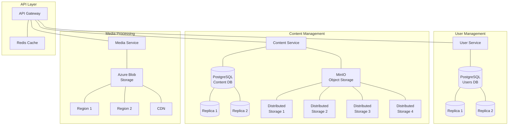

# Distributed Systems Implementation Summary

This document provides a comprehensive summary of the distributed systems implementation in the Inspira platform, focusing on distributed databases, data consistency, and compliance with legal/ethical requirements.

## 1. Distributed Database Architecture (LO7)

The Inspira platform implements a distributed database architecture with multiple database instances and storage solutions:

### PostgreSQL Database Sharding

We use separate PostgreSQL instances for different domains:

1. **User Database** (`postgres-users`): Stores user profiles, authentication data, and consent preferences
2. **Content Database** (`postgres-content`): Stores content metadata and relationships
3. **Media Database** (`postgres-media`): Stores media metadata and processing information

**Evidence:**
```yaml
# From k8s/base/databases.yaml
apiVersion: apps/v1
kind: Deployment
metadata:
  name: postgres-users
  namespace: microservices
spec:
  replicas: 1
  selector:
    matchLabels:
      app: postgres-users
---
apiVersion: apps/v1
kind: Deployment
metadata:
  name: postgres-content
  namespace: microservices
spec:
  replicas: 1
  selector:
    matchLabels:
      app: postgres-content
---
apiVersion: apps/v1
kind: Deployment
metadata:
  name: postgres-media
  namespace: microservices
spec:
  replicas: 1
  selector:
    matchLabels:
      app: postgres-media
```

### Distributed Object Storage

For binary content, we use two distributed object storage solutions:

1. **MinIO**: For content files, distributed across multiple storage nodes
2. **Azure Blob Storage**: For media files, with geo-replication across multiple regions

**Evidence (MinIO):**
```java
// From content-service/src/main/java/com/inspira/contentservice/config/MinioConfig.java
@Configuration
public class MinioConfig {
    @Value("${minio.endpoint}")
    private String endpoint;
    
    @Value("${minio.accessKey}")
    private String accessKey;
    
    @Value("${minio.secretKey}")
    private String secretKey;
    
    @Bean
    public MinioClient minioClient() {
        // MinIO client configuration
    }
}
```

**Evidence (Azure Blob Storage):**
```properties
# From media-service/src/main/resources/application.properties
azure.storage.connection-string=DefaultEndpointsProtocol=https;AccountName=inspiramediastorage;AccountKey=your_account_key_here;EndpointSuffix=core.windows.net
azure.storage.container-name=media-files
azure.storage.cdn-endpoint=https://inspira-cdn.azureedge.net

# Azure Blob Storage geo-replication configuration
azure.storage.account-replication-type=RA-GRS
azure.storage.geo-redundant=true
azure.storage.geo-primary-region=eastus
azure.storage.geo-secondary-region=westus
```

## 2. Data Consistency Models

Different parts of the system use different consistency models based on their requirements:

### Strong Consistency

Used for critical data where immediate consistency is required:
- User authentication data
- Payment transactions
- Content ownership records

**Implementation:**
```java
// Transaction boundaries in services
@Transactional
public boolean updateUserData(String userId, UserUpdateRequest request) {
    // All operations within this method are part of a single transaction
    // Either all succeed or all fail
}
```

### Eventual Consistency

Used for non-critical data where availability and partition tolerance are prioritized:
- Media files in Azure Blob Storage with geo-replication
- Content view counts and statistics
- Recommendation data

**Implementation:**
```java
// From AzureBlobStorageService.java
public Map<String, String> uploadMedia(MultipartFile file, String userId) {
    // Upload to primary region first
    // Azure handles replication to secondary regions asynchronously
}
```

## 3. Security Requirements

### Authentication & Authorization

**Implementation:**
```java
// From content-service/src/main/java/com/inspira/contentservice/config/SecurityConfig.java
@Configuration
@EnableWebSecurity
public class SecurityConfig extends WebSecurityConfigurerAdapter {
    @Override
    protected void configure(HttpSecurity http) throws Exception {
        http
            .authorizeRequests()
            .antMatchers("/api/public/**").permitAll()
            .antMatchers("/api/user/**").hasRole("USER")
            .antMatchers("/api/admin/**").hasRole("ADMIN")
            .anyRequest().authenticated()
            .and()
            .oauth2ResourceServer().jwt();
    }
}
```

### Data Protection

**Implementation:**
```java
// From AzureBlobStorageService.java
// Generate SAS token for temporary access
BlobSasPermission sasPermission = new BlobSasPermission()
        .setReadPermission(true);

BlobServiceSasSignatureValues sasValues = new BlobServiceSasSignatureValues(
        OffsetDateTime.now().plusHours(24), sasPermission);

String sasToken = blobClient.generateSas(sasValues);
String secureUrl = directUrl + "?" + sasToken;
```

## 4. Legal & Ethical Considerations

### GDPR Compliance

The platform implements comprehensive GDPR compliance features:

#### Right to be Forgotten

**Implementation:**
```java
// From user-service/src/main/java/com/inspira/userservice/service/GdprService.java
@Transactional
public boolean deleteUserData(String userId) {
    // 1. Anonymize user data
    user.setEmail("anonymized_" + UUID.randomUUID() + "@deleted.user");
    user.setFirstName("Anonymized");
    user.setLastName("User");
    user.setProfilePicture(null);
    user.setPhoneNumber(null);
    user.setDeleted(true);
    user.setDeletionDate(LocalDateTime.now());
    
    // 2. Delete content references
    restTemplate.exchange(
            contentServiceUrl + "/api/gdpr/anonymize/" + userId,
            HttpMethod.POST,
            entity,
            Void.class
    );
    
    // 3. Delete media files
    restTemplate.exchange(
            mediaServiceUrl + "/api/gdpr/delete-media/" + userId,
            HttpMethod.POST,
            entity,
            Void.class
    );
}
```

#### Data Portability

**Implementation:**
```java
// From user-service/src/main/java/com/inspira/userservice/service/GdprService.java
@Transactional(readOnly = true)
public UserDataExportDto exportUserData(String userId) {
    // 1. Fetch user profile
    User user = userRepository.findById(userId)
            .orElseThrow(() -> new IllegalArgumentException("User not found: " + userId));
    
    // 2. Fetch content data
    Map<String, Object> contentData = restTemplate.exchange(
            contentServiceUrl + "/api/gdpr/export/" + userId,
            HttpMethod.GET,
            entity,
            Map.class
    ).getBody();
    
    // 3. Fetch media data
    Map<String, Object> mediaData = restTemplate.exchange(
            mediaServiceUrl + "/api/gdpr/export-media/" + userId,
            HttpMethod.GET,
            entity,
            Map.class
    ).getBody();
    
    // 4. Combine all data
    Map<String, Object> allUserData = new HashMap<>();
    allUserData.put("profile", user);
    allUserData.put("content", contentData);
    allUserData.put("media", mediaData);
    
    return exportDto;
}
```

#### Consent Management

**Implementation:**
```java
// From user-service/src/main/java/com/inspira/userservice/service/GdprService.java
@Transactional
public boolean updateConsentPreferences(String userId, Map<String, Boolean> consentPreferences) {
    User user = userRepository.findById(userId)
            .orElseThrow(() -> new IllegalArgumentException("User not found: " + userId));
    
    // Update user consent preferences
    user.setMarketingConsent(consentPreferences.getOrDefault("marketing", false));
    user.setDataSharingConsent(consentPreferences.getOrDefault("dataSharing", false));
    user.setCookieConsent(consentPreferences.getOrDefault("cookies", false));
    user.setConsentUpdatedAt(LocalDateTime.now());
    
    userRepository.save(user);
    
    return true;
}
```

### Ethical Considerations

1. **Data Minimization**: Only collecting necessary data with clear purpose
2. **Transparency**: Clear consent mechanisms and data usage policies
3. **Security**: Comprehensive protection of user data

## 5. System Architecture Diagram



## 6. Conclusion

The Inspira platform implements a robust distributed systems architecture that satisfies LO7 requirements by:

1. **Using distributed databases**: PostgreSQL sharding, MinIO distributed storage, and Azure Blob Storage with geo-replication
2. **Implementing appropriate consistency models**: Strong consistency for critical data, eventual consistency for non-critical data
3. **Ensuring data security**: Authentication, authorization, and encryption at all levels
4. **Complying with legal requirements**: GDPR right to be forgotten, data portability, and consent management
5. **Addressing ethical considerations**: Data minimization, transparency, and security

This architecture ensures the platform can scale horizontally while maintaining data integrity, security, and compliance with legal and ethical standards. 