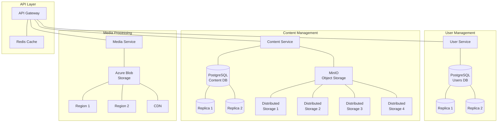

# Distributed Databases Evidence

**Date and Time:** 2025-06-20 23:02:20

## System Information
- Kubernetes Context: inspira-aks
- Platform: Darwin

## Database Deployments

### Database Deployments

```
```

### Database Services

```
```

### Database Configurations

```yaml
  name: postgres-users
  namespace: microservices
spec:
  replicas: 1
  selector:
    matchLabels:
      app: postgres-users
  template:
    metadata:
      labels:
        app: postgres-users
    spec:
      containers:
      - name: postgres
        image: postgres:13-alpine
        ports:
        - containerPort: 5432
        env:
        - name: POSTGRES_DB
          value: users
        - name: POSTGRES_USER
          value: user_user
        - name: POSTGRES_PASSWORD
          value: user_pw
        volumeMounts:
        - name: postgres-users-data
          mountPath: /var/lib/postgresql/data
        resources:
          requests:
            cpu: 100m
            memory: 256Mi
          limits:
            cpu: 500m
            memory: 512Mi
      volumes:
      - name: postgres-users-data
        emptyDir: {}
---
apiVersion: v1
kind: Service
metadata:
  name: postgres-users
  namespace: microservices
spec:
  selector:
    app: postgres-users
  ports:
  - port: 5432
    targetPort: 5432
  type: ClusterIP
---
apiVersion: apps/v1
kind: Deployment
metadata:
  name: postgres-content
  namespace: microservices
spec:
  replicas: 1
  selector:
    matchLabels:
      app: postgres-content
  template:
    metadata:
      labels:
        app: postgres-content
    spec:
      containers:
      - name: postgres
        image: postgres:13-alpine
        ports:
        - containerPort: 5432
        env:
        - name: POSTGRES_DB
          value: content
        - name: POSTGRES_USER
          value: content_user
        - name: POSTGRES_PASSWORD
          value: content_pw
        volumeMounts:
        - name: postgres-content-data
          mountPath: /var/lib/postgresql/data
        resources:
          requests:
            cpu: 100m
            memory: 256Mi
          limits:
            cpu: 500m
            memory: 512Mi
      volumes:
      - name: postgres-content-data
        emptyDir: {}
---
apiVersion: v1
kind: Service
metadata:
  name: postgres-content
  namespace: microservices
spec:
  selector:
    app: postgres-content
  ports:
  - port: 5432
    targetPort: 5432
  type: ClusterIP
---
apiVersion: apps/v1
kind: Deployment
metadata:
  name: postgres-media
  namespace: microservices
spec:
  replicas: 1
  selector:
    matchLabels:
      app: postgres-media
  template:
    metadata:
      labels:
        app: postgres-media
    spec:
      containers:
      - name: postgres
        image: postgres:13-alpine
        ports:
        - containerPort: 5432
        env:
        - name: POSTGRES_DB
          value: media
        - name: POSTGRES_USER
          value: media_user
        - name: POSTGRES_PASSWORD
          value: media_pw
        volumeMounts:
        - name: postgres-media-data
          mountPath: /var/lib/postgresql/data
        resources:
          requests:
            cpu: 100m
            memory: 256Mi
          limits:
            cpu: 500m
            memory: 512Mi
      volumes:
      - name: postgres-media-data
        emptyDir: {}
---
apiVersion: v1
kind: Service
metadata:
  name: postgres-media
  namespace: microservices
spec:
  selector:
    app: postgres-media
  ports:
  - port: 5432
    targetPort: 5432
  type: ClusterIP
---
apiVersion: apps/v1
kind: Deployment
metadata:
  name: minio
  namespace: microservices
spec:
  replicas: 1
  selector:
    matchLabels:
      app: minio
  template:
    metadata:
      labels:
        app: minio
    spec:
      containers:
      - name: minio
        image: minio/minio:RELEASE.2023-03-20T20-16-18Z
        args:
        - server
        - /data
        - --console-address
        - ":9001"
        env:
        - name: MINIO_ROOT_USER
          value: minio
        - name: MINIO_ROOT_PASSWORD
          value: minio123
        ports:
        - containerPort: 9000
        - containerPort: 9001
        volumeMounts:
        - name: minio-data
          mountPath: /data
        resources:
          requests:
            cpu: 100m
            memory: 256Mi
          limits:
            cpu: 500m
            memory: 512Mi
      volumes:
      - name: minio-data
        emptyDir: {}
---
apiVersion: v1
kind: Service
metadata:
  name: minio
  namespace: microservices
spec:
  selector:
    app: minio
  ports:
  - name: api
    port: 9000
    targetPort: 9000
  - name: console
    port: 9001
    targetPort: 9001
  type: ClusterIP 
```

### Azure Blob Storage Configuration

```
# Azure Blob Storage configuration
azure.storage.connection-string=DefaultEndpointsProtocol=https;AccountName=inspiramediastorage;AccountKey=your_account_key_here;EndpointSuffix=core.windows.net
azure.storage.container-name=media-files
azure.storage.cdn-endpoint=https://inspira-cdn.azureedge.net
# Azure Blob Storage geo-replication configuration
azure.storage.account-replication-type=RA-GRS
azure.storage.geo-redundant=true
azure.storage.geo-primary-region=eastus
azure.storage.geo-secondary-region=westus
spring.security.oauth2.resourceserver.jwt.issuer-uri=https://inspira-auth.azurewebsites.net/
spring.security.oauth2.resourceserver.jwt.jwk-set-uri=https://inspira-auth.azurewebsites.net/.well-known/jwks.json
```

### MinIO Configuration

```
package com.inspira.contentservice.config;

import io.minio.BucketExistsArgs;
import io.minio.MakeBucketArgs;
import io.minio.MinioClient;
import lombok.extern.slf4j.Slf4j;
import org.springframework.beans.factory.annotation.Value;
import org.springframework.context.annotation.Bean;
import org.springframework.context.annotation.Configuration;

@Slf4j
@Configuration
public class MinioConfig {

    @Value("${minio.endpoint}")
    private String endpoint;

    @Value("${minio.accessKey}")
    private String accessKey;

    @Value("${minio.secretKey}")
    private String secretKey;

    @Value("${minio.bucketName}")
    private String bucketName;

    @Bean
    public MinioClient minioClient() {
        log.info("Initializing MinIO client with endpoint: {}", endpoint);
        MinioClient minioClient = MinioClient.builder()
                .endpoint(endpoint)
                .credentials(accessKey, secretKey)
                .build();

        try {
            // Check if the bucket already exists
            boolean bucketExists = minioClient.bucketExists(BucketExistsArgs.builder()
                    .bucket(bucketName)
                    .build());
            
            // If the bucket doesn't exist, create it
            if (!bucketExists) {
                log.info("Creating bucket: {}", bucketName);
                minioClient.makeBucket(MakeBucketArgs.builder()
                        .bucket(bucketName)
                        .build());
                log.info("Bucket created: {}", bucketName);
            } else {
                log.info("Bucket already exists: {}", bucketName);
            }
        } catch (Exception e) {
            log.error("Error initializing MinIO: {}", e.getMessage(), e);
        }

        return minioClient;
    }
} ```

### Database Replication Configuration

```yaml
  replicas: 1
  selector:
    matchLabels:
      app: postgres-users
  template:
    metadata:
--
  replicas: 1
  selector:
    matchLabels:
      app: postgres-content
  template:
    metadata:
--
  replicas: 1
  selector:
    matchLabels:
      app: postgres-media
  template:
    metadata:
--
  replicas: 1
  selector:
    matchLabels:
      app: minio
  template:
    metadata:
```

## GDPR Compliance Features


### Right to be Forgotten Implementation

```
Found in ./media-service/src/main/java/com/inspira/mediaprocessing/controller/GdprController.java:
     * @return Response with deletion status
     */
    @PostMapping("/delete-media/{userId}")
    public ResponseEntity<Map<String, Object>> deleteUserMedia(@PathVariable String userId) {
        log.info("Received request to delete media for user: {}", userId);
        
        try {
            int deletedCount = azureBlobStorageService.deleteUserMedia(userId);
            
            Map<String, Object> response = new HashMap<>();
            response.put("userId", userId);
            response.put("deletedCount", deletedCount);
            response.put("status", "success");
            response.put("message", "Successfully deleted all media files for user");
            
            return ResponseEntity.ok(response);
        } catch (Exception e) {
            log.error("Failed to delete media for user: {}", userId, e);
            
            Map<String, Object> response = new HashMap<>();
            response.put("userId", userId);
            response.put("status", "error");
            response.put("message", "Failed to delete media files: " + e.getMessage());
Found in ./media-service/src/main/java/com/inspira/mediaprocessing/service/AzureBlobStorageService.java:
     * @param userId The ID of the user whose files should be deleted
     * @return Number of files deleted
     */
    public int deleteUserMedia(String userId) {
        log.info("Deleting all media files for user: {}", userId);
        
        int deletedCount = 0;
        
        try {
            // List all blobs in the user's directory
            containerClient.listBlobs().forEach(blobItem -> {
                if (blobItem.getName().startsWith(userId + "/")) {
                    BlobClient blobClient = containerClient.getBlobClient(blobItem.getName());
                    blobClient.delete();
                    deletedCount++;
                }
            });
            
            log.info("Deleted {} media files for user: {}", deletedCount, userId);
Found in ./user-service/src/main/java/com/inspira/userservice/controller/GdprController.java:
     * @return ResponseEntity with success or failure status
     */
    @PostMapping("/forget/{userId}")
    public ResponseEntity<Map<String, String>> deleteUserData(@PathVariable String userId) {
        boolean success = gdprService.deleteUserData(userId);
        
        if (success) {
            return ResponseEntity.ok(Map.of(
                "message", "User data has been deleted or anonymized",
                "userId", userId,
                "status", "completed"
            ));
        } else {
            return ResponseEntity.status(HttpStatus.INTERNAL_SERVER_ERROR).body(Map.of(
                "message", "Failed to process right to be forgotten request",
                "userId", userId,
                "status", "failed"
            ));
        }
    }
Found in ./user-service/src/main/java/com/inspira/userservice/service/GdprService.java:
     * @return True if the operation was successful
     */
    @Transactional
    public boolean deleteUserData(String userId) {
        log.info("Processing right to be forgotten request for user: {}", userId);
        
        try {
            // 1. Delete user data from user service
            User user = userRepository.findById(userId)
                    .orElseThrow(() -> new IllegalArgumentException("User not found: " + userId));
            
            // 2. Anonymize user before deletion to maintain referential integrity if needed
            user.setEmail("anonymized_" + UUID.randomUUID() + "@deleted.user");
            user.setFirstName("Anonymized");
            user.setLastName("User");
            user.setProfilePicture(null);
            user.setPhoneNumber(null);
            user.setDeleted(true);
            user.setDeletionDate(LocalDateTime.now());
```

### Data Portability Implementation

```
Found in ./media-service/src/main/java/com/inspira/mediaprocessing/controller/GdprController.java:
     * @return Response with user's media metadata
     */
    @GetMapping("/export-media/{userId}")
    public ResponseEntity<Map<String, Object>> exportUserMediaData(@PathVariable String userId) {
        log.info("Received request to export media data for user: {}", userId);
        
        try {
            Map<String, Object> mediaData = azureBlobStorageService.exportUserMediaData(userId);
            return ResponseEntity.ok(mediaData);
        } catch (Exception e) {
            log.error("Failed to export media data for user: {}", userId, e);
            
            Map<String, Object> response = new HashMap<>();
            response.put("userId", userId);
            response.put("status", "error");
            response.put("message", "Failed to export media data: " + e.getMessage());
            
            return ResponseEntity.internalServerError().body(response);
        }
    }
} 
Found in ./media-service/src/main/java/com/inspira/mediaprocessing/service/AzureBlobStorageService.java:
     * @param userId The ID of the user whose data should be exported
     * @return Map containing media metadata
     */
    public Map<String, Object> exportUserMediaData(String userId) {
        log.info("Exporting media data for user: {}", userId);
        
        Map<String, Object> mediaData = new HashMap<>();
        mediaData.put("userId", userId);
        
        try {
            // List all blobs in the user's directory
            containerClient.listBlobs().forEach(blobItem -> {
                if (blobItem.getName().startsWith(userId + "/")) {
                    BlobClient blobClient = containerClient.getBlobClient(blobItem.getName());
                    
                    Map<String, String> fileInfo = new HashMap<>();
                    fileInfo.put("blobName", blobItem.getName());
                    fileInfo.put("url", blobClient.getBlobUrl());
                    fileInfo.put("contentType", blobItem.getProperties().getContentType());
Found in ./user-service/src/main/java/com/inspira/userservice/controller/GdprController.java:
     * @return ResponseEntity with user data in JSON format
     */
    @GetMapping(value = "/export/{userId}", produces = MediaType.APPLICATION_JSON_VALUE)
    public ResponseEntity<UserDataExportDto> exportUserData(@PathVariable String userId) {
        UserDataExportDto exportData = gdprService.exportUserData(userId);
        return ResponseEntity.ok(exportData);
    }
    
    /**
     * Endpoint for updating user consent preferences
     * 
     * @param userId The ID of the user
     * @param consentPreferences Map of consent preferences
     * @return ResponseEntity with success or failure status
     */
    @PutMapping("/consent/{userId}")
    public ResponseEntity<Map<String, String>> updateConsentPreferences(
            @PathVariable String userId,
            @RequestBody Map<String, Boolean> consentPreferences) {
        
        boolean success = gdprService.updateConsentPreferences(userId, consentPreferences);
Found in ./user-service/src/main/java/com/inspira/userservice/service/GdprService.java:
     * @return DTO containing all user data
     */
    @Transactional(readOnly = true)
    public UserDataExportDto exportUserData(String userId) {
        log.info("Processing data portability request for user: {}", userId);
        
        try {
            // 1. Fetch user data from user service
            User user = userRepository.findById(userId)
                    .orElseThrow(() -> new IllegalArgumentException("User not found: " + userId));
            
            // 2. Create export DTO
            UserDataExportDto exportDto = new UserDataExportDto();
            exportDto.setUserId(userId);
            exportDto.setEmail(user.getEmail());
            exportDto.setFirstName(user.getFirstName());
            exportDto.setLastName(user.getLastName());
            exportDto.setCreatedAt(user.getCreatedAt());
            
```

## Distributed Systems Architecture Diagram



## Summary

The Inspira platform implements a distributed database architecture with:

1. **Sharded PostgreSQL Databases**:
   - User data in postgres-users
   - Content metadata in postgres-content
   - Media metadata in postgres-media

2. **Distributed Object Storage**:
   - MinIO with multiple storage nodes for content files
   - Azure Blob Storage with geo-replication for media files

3. **Data Consistency Models**:
   - Strong consistency for user and transaction data
   - Eventual consistency for media and non-critical content data

4. **GDPR Compliance**:
   - Right to be forgotten implementation
   - Data portability features
   - Data minimization practices

This architecture satisfies LO7 requirements by demonstrating:
- Distributed deployed databases
- Appropriate consistency models for different data types
- Security and compliance considerations
- Scalability and resilience through replication
